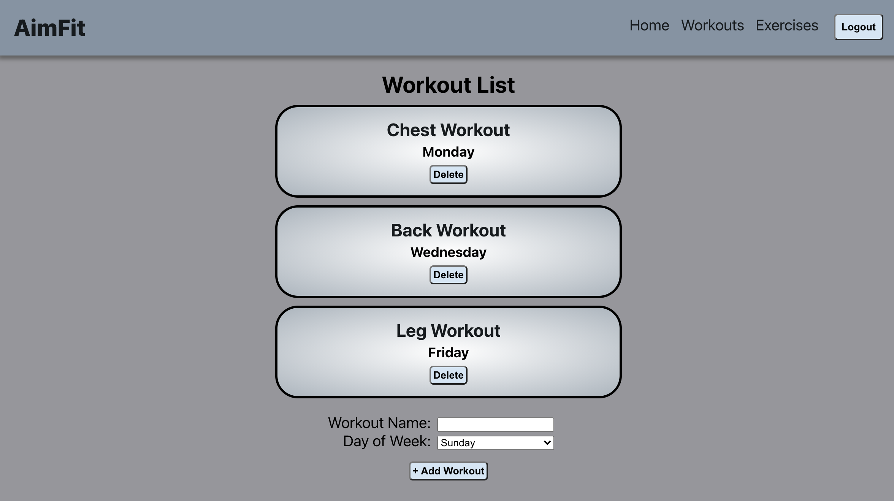

# AimFit
 * * *
 

 ## Live
 --------------

Demo: [https://aimfit-app.vercel.app/](https://aimfit-app.vercel.app/)  
Client Repo: [https://github.com/jessetran03/aimfit](https://github.com/jessetran03/aimfit)  
Server Repo: [https://github.com/jessetran03/aimfit-api](https://github.com/jessetran03/aimfit-api)

## Summary
 --------------

 AimFit is a web application that helps you to reach your fitness goals. The application allows the user to create their own workouts and customize the workouts to their needs. The user can also assign a day to each workout to help them organize their weekly workout plan.

## API Documentation
 --------------
 POST /api/auth/login  
 POST /api/users  
 GET /api/workouts  
 POST /api/workouts  
 GET /api/workouts/:workout_id  
 DELETE /api/workouts/:workout_id  
 GET /api/workouts/:workout_id/exercises  
 DELETE /api/workouts/exercises/:workout_exercise_id  
 GET /api/workout_exercises  
 POST /api/workout_exercises  
 DELETE /api/workout_exercises/:workout_exercise_id  
 GET /api/exercies

 ## Screenshots
  --------------
 Landing Page:
 

 Login Page:
 

 Workout List Page:
 

 Workout Exercises Page:
 

 Exercise list Page:
 

 Exercise Log Page:
 

 ## Technologies Used
 --------------

 1. JavaScript
 2. JWT
 3. Node
 4. Express
 5. Chai, Mocha

 psql -U dunder_mifflin -d aimfit -f ./seeds/seed.aimfit_tables.sql
